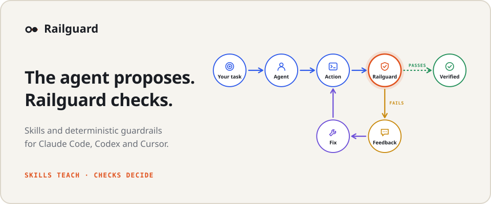

<p align="center">
  <picture>
    <source media="(prefers-color-scheme: dark)" srcset="docs/assets/banner-dark.svg">
    
  </picture>
</p>

<p align="center">
  
  
  
</p>

<p align="center">
  <a href="https://rendis.github.io/agent-railguard/"><b>▶ Open the visual guide</b></a>
</p>

**Railguard** (`railguard`) gives code written by coding agents a quality floor that does not depend
on someone reading every line of it.

## Why

Agents write a growing share of the code, and people review less of it line by line: review does not
scale with what agents produce. An agent under pressure also takes shortcuts. It silences a linter,
deletes the test that fails, or says "done" while the checks are red, and a skimmed diff lets that
through.

Railguard moves that part of quality from trusting review to verifying it mechanically. It
configures a Git repository so Claude Code, Codex and Cursor work with specialized skills and inside
deterministic guardrails. Every action of the agent goes through checks; when one fails, the reason
goes back to the agent, which fixes it before it reaches your branch. What a check can decide, a
check decides. People keep what only a person can judge: design, semantics and whether the change
is the right one.

The [visual guide](https://rendis.github.io/agent-railguard/) walks through this loop step by step,
with what happens underneath each node: the hook that runs, the file involved and Railguard's real
output.

## Where it checks

Five moments; each one catches what slipped past the previous one. Only what the change touched is
judged: the debt the repository already had blocks nobody.

| Moment | What it catches |
| --- | --- |
| Before acting | Skipping the Git hooks, editing `.railguard/` or protected quality configuration, writing a `Railguard-Allow` trailer. |
| On each edit | Suppressions, protected configuration, deleted or removed tests and secrets in the edited files, in about a second. |
| When the turn ends | `railguard check --changed`; the agent does not finish with red checks (up to three attempts, then the next session is told). |
| Commit and push | `check --changed` and `verify --changed` as Git gates through `core.hooksPath`. |
| CI | `.railguard/verify.sh verify`, generated from the project. It does not install Railguard and nobody skips it. |

Only a person can accept a finding, with a `Railguard-Allow` trailer in a commit they make. Details
in [Quality guardrails](docs/guardrails.md).

## What the agent receives

The agent adds `//nolint:all` to silence the linter. A second later, in its own session:

```text
Railguard found problems in internal/orders/refund.go right after
your edit. Fix the cause now instead of hiding it:

  FAIL change-guard/integrity  1 change(s) weaken what the checks can see
      internal/orders/refund.go:4: lint suppression: … //nolint:all
```

If it then tries `git commit --no-verify`, the command never runs:

```text
Do not skip the Git hooks: they run the checks this repository requires. Fix what fails instead.
```

## Installation

```bash
curl -fsSL https://raw.githubusercontent.com/rendis/agent-railguard/main/install.sh | bash
```

Installs a self-contained binary (engine + catalog + skills) into `~/.local/bin` after verifying
its SHA-256, and with an authenticated `gh` also its build provenance. It works on macOS, Linux and
Windows (from Git Bash, with Git for Windows). A repository is updated with
`railguard update --yes`; every command tells you when a new release is out. Details in
[Installation and updates](docs/installation.md).

## Get started

From the repository you want to configure. Nothing is written until you see the plan:

```bash
railguard scan                                   # stack, Git and agents; changes nothing
railguard init --add pack:go-service-foundation --harness claude-code codex --plan-only
railguard init --add pack:go-service-foundation --harness claude-code codex --yes
```

`railguard` without a subcommand opens a wizard with the same steps when stdin and stdout are
terminals. `railguard status` and `railguard repair` observe the filesystem and Git again; they
never assume an artifact exists because it is listed in `.railguard/lock.json`. Everything is
project-scoped: the launcher `.railguard/bin/railguard` pins the engine version, so the whole team
uses the same one.

<details>
<summary><b>What stays in your repository</b></summary>
<br>

| Path | What it is |
| --- | --- |
| `AGENTS.md` | One managed block per group (`skills.mapping`, `mcps.mapping`, `agents.mapping`, `automation.mapping`, `quality.mapping`); whatever you write outside them is yours. |
| `.agents/skills/` | The shared skills; on POSIX, Claude uses relative aliases from `.claude/skills`. |
| `.claude/`, `.codex/`, `.cursor/` | The hooks and agents of each selected harness. |
| MCP | Context7 through `npx -y @upstash/context7-mcp@4.0.0`, with no login or API key. Atlassian Rovo through the harness's native OAuth; Railguard never receives or stores tokens ([MCP authentication](docs/mcp-authentication.md)). |
| `.railguard/project.yaml` | What you chose. Change it by editing it and running `railguard sync --yes`. |
| `.railguard/lock.json` | Which files belong to Railguard; it never deletes foreign content. |
| `.railguard/verify.sh` | The whole-repository rules; what CI runs. |
| `.railguard/bin/railguard` | The launcher that pins the engine version. |
| `.railguard/hooks/`, `.railguard/agent-hooks/` | The Git gates and the agent hooks; all of them call the launcher. |

The only thing not versioned is `core.hooksPath`: the first Railguard command in each clone turns
it on and says so.

</details>

## Report a bug or propose an improvement

```bash
railguard issue bug                  # or: railguard issue improvement
railguard issue --check draft.md     # before publishing
```

Prints the guide and the issue template, and checks the draft before you publish it. An issue
describes what Railguard did, without company, project or personal data. See
[Reporting a bug or proposing an improvement](docs/reporting-issues.md).

## Documentation

- Start: [visual guide](https://rendis.github.io/agent-railguard/) · [installation and updates](docs/installation.md) · [interactive wizard](docs/tui.md) · [CLI, formats and exit codes](docs/cli.md)
- Understand: [quality guardrails](docs/guardrails.md) · [security model](docs/security.md) · [MCP authentication and Atlassian](docs/mcp-authentication.md) · [product decisions](docs/decisions.md)
- When something fails: [troubleshooting and recovery](docs/troubleshooting.md) · [reporting a bug or proposing an improvement](docs/reporting-issues.md)
- Contribute: [catalog authoring](docs/catalog-authoring.md) · [status and next steps](docs/status.md)

<details>
<summary><b>Develop Railguard</b></summary>
<br>

| Path | What it is |
| --- | --- |
| `src/` | The TypeScript engine, in layers (`domain`, `application`, `adapters`, `catalog`, `cli`, `tui`); `.dependency-cruiser.cjs` enforces their boundaries. |
| `railguard.yaml`, `skills/` | The catalog and the skill payloads, embedded in the binary. |
| `schemas/` | The public contracts: catalog, project state, plan, event and result. |
| `tests/` | Behavior tests on temporary repositories. |
| `docs/` | The documentation, the visual guide (`docs/guide/`) and the README banner (`docs/assets/`, rendered by `node scripts/docs/render-banner.mjs`). |

Requires Node `>=24.19.0 <25.0.0`, pnpm `11.21.0`, Go `1.26` for the skill script tests and, to
build binaries, Bun.

```bash
pnpm install --frozen-lockfile
pnpm run check
bash install.sh --local      # builds and installs the binary for this platform
```

Changes to `railguard.yaml` or `skills/` are tried without rebuilding with
`railguard --source /path/to/checkout`. Agents working on this repository start at
[`AGENTS.md`](AGENTS.md).

</details>

## License

[MIT](LICENSE)
